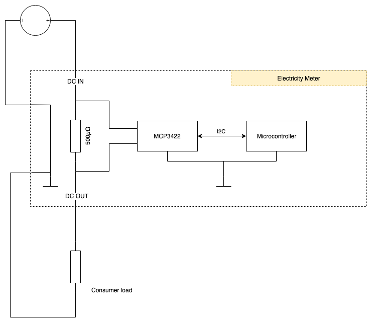

# DC Meter Assessment 

Running this project in the command line simulates reading a current value 
from an ADC. This value is the printed to the command line.

The ADC being used is a MCP3424: https://www.microchip.com/wwwproducts/en/MCP3424

## Task
The main task is to complete the project as you would if it was a real world task.

Feel free to:
 * Implement additional fake ic support that may be required
 * Add or change this file to fit your implementation
 * Create additional files to support your architecture
 * Continue building manually, update the cmake file or swap to using make


## Building & Running

Building and running the project can be perform with the following commands.

```shell
gcc main.c -o main.o
./main.o
```

There is also a CMakeList.txt file for building the project in CMake or developing
using a CMake compatibles IDE such as CLion

## Diagram


